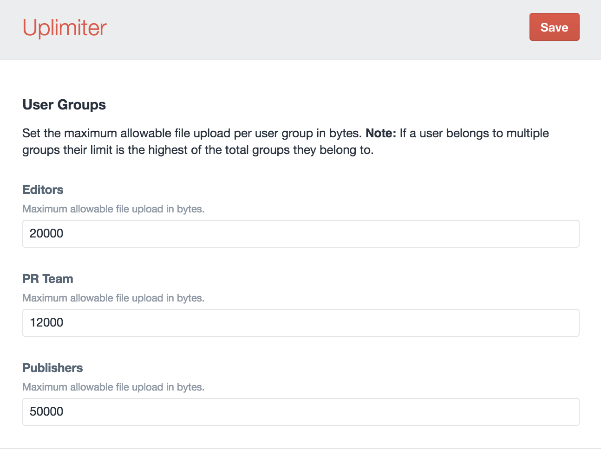

# &nbsp;Uplimiter

Easily define the maximum file upload size per user group.

## Installation

To install Uplimiter, follow these steps:

1. Download & unzip the file and place the inner `uplimiter` directory in your `craft/plugins` folder
2. Install plugin in the Craft Control Panel under Settings > Plugins
3. The plugin folder should be named `uplimiter` for Craft to recognize it
4. In settings, set the maximum file size (in bytes) for each of your member groups

## Contributing
We welcome anyone and everyone who would like to improve Uplimiter to fork it and send in pull requests.

## Changelog

[View the JSON changelog](https://github.com/trendyminds/uplimiter/blob/master/releases.json)
